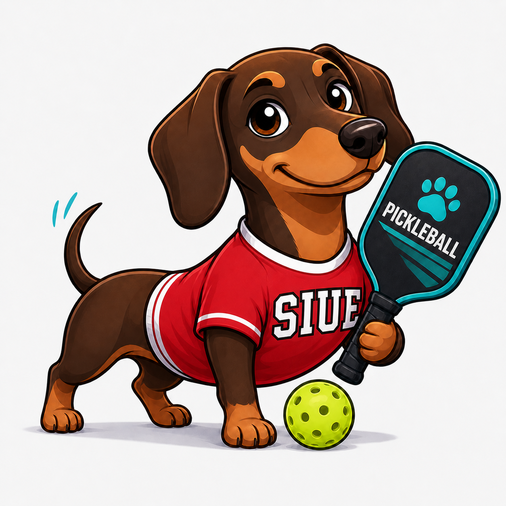
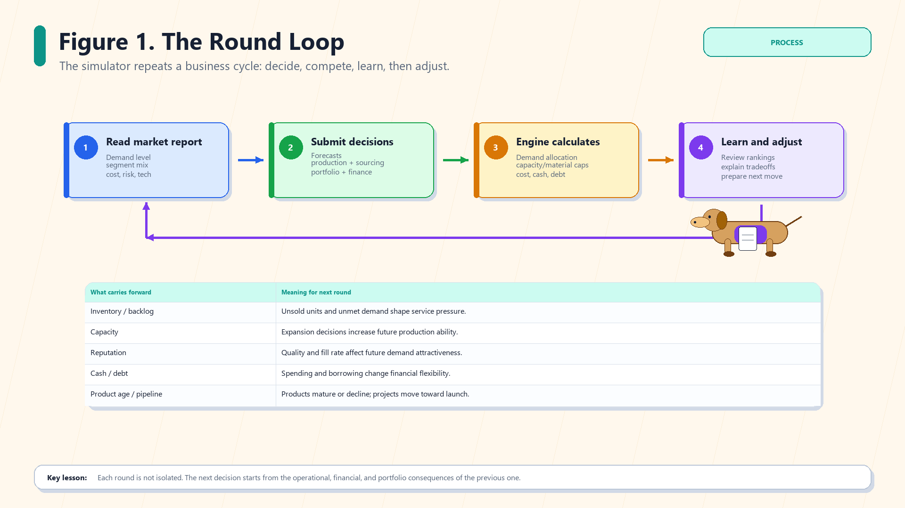
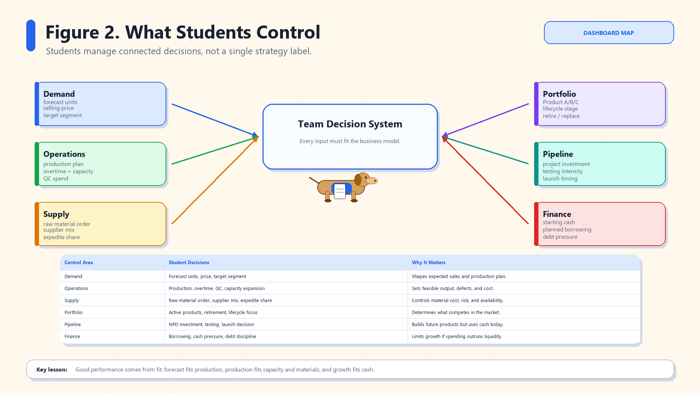
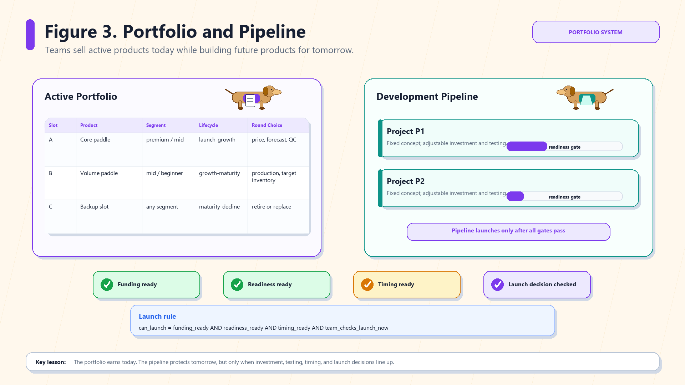

# Kiki Pickleball Business Simulation

<p align="center">
  
</p>

Kiki Pickleball Business Simulation is a hosted-ready Streamlit classroom game for teaching operations management, supply chain management, product portfolio decisions, demand forecasting, S&OP discipline, product development, and cash-control tradeoffs.

Students run competing pickleball paddle companies. Each round, they read the market, forecast demand, plan production, choose supplier mix, manage quality, invest in new products, and protect cash. The instructor controls the market environment, opens and closes submissions, runs the round engine, and leads the debrief.

## Why It Works Well For Operations Management

This simulator is built around tradeoffs, not trivia. Students quickly learn that high sales, high profit, strong service, accurate forecasts, innovation, and healthy cash do not always move together.

| Teaching concept | What students do in the game | Class discussion |
|---|---|---|
| Demand forecasting | Forecast product-level demand before production. | Did the forecast guide the plan or just justify it? |
| S&OP discipline | Align forecast, production, materials, capacity, inventory, and cash. | Was the plan coherent across functions? |
| Capacity planning | Choose overtime and expansion. | Did growth create value or just cost? |
| Supplier mix | Balance offshore, balanced, and premium sourcing. | Did cheaper sourcing increase risk or defects? |
| Quality control | Spend QC dollars per unit. | When is quality worth the cost? |
| Inventory and backlog | Decide how much stock and backlog risk to tolerate. | Did service improve or did inventory trap cash? |
| Portfolio management | Manage up to three active paddle products. | Which product actually created value? |
| Product lifecycle | Products age through launch, growth, maturity, and decline. | Did teams refresh the portfolio at the right time? |
| NPD and technology | Invest in future products and technology generations. | Did innovation happen too early, too late, or just right? |
| Cash discipline | Track cash, borrowing, debt, interest, and working capital. | Can a profitable team still become financially fragile? |

The core lesson: there is no permanent best strategy. The best team depends on the market environment and the performance objective.

## The Round Loop

<p align="center">
  
</p>

Each round is a business cycle. The next decision starts from the operational, financial, and portfolio consequences of the previous round.

## What Students Control

<p align="center">
  
</p>

Students do not simply choose a strategy label. They make connected numerical decisions across demand, operations, supply, portfolio, pipeline, and finance.

## Portfolio And Pipeline

<p align="center">
  
</p>

Teams sell active products today while investing in future products for tomorrow. Launches require funding progress, readiness, timing, and a team launch decision.

## What The App Supports

- Hosted Streamlit app with `admin` and `team_leader` roles
- SQLite persistence for one classroom app instance
- First-run admin setup with hashed passwords
- Instructor-created student/team accounts
- Public market report and scenario presets
- Product-level pricing, forecasting, production, QC, and inventory decisions
- Firm-level capacity, supplier mix, raw material, backlog, borrowing, and cash decisions
- Up to three active product slots per team
- Up to two product-development project slots per team
- Lifecycle stages: `launch`, `growth`, `maturity`, `decline`
- Technology generations and market technology pressure
- Product-level demand allocation and product-level results
- Intra-team cannibalization between related products
- Forecast accuracy, service level, profit, cash, debt, and innovation analytics
- Instructor dashboard, formula guide, finance detail, CSV exports, and documentation
- Offline 20-environment experiment runner for calibration and teaching research

This version intentionally excludes marketing, ambassador strategy, retailer negotiation, team-member accounts, multi-country operations, and heavy Monte Carlo systems.

## Quick Start: Run Locally

Use local mode for testing on your own computer.

```powershell
python -m venv .venv
.\.venv\Scripts\python.exe -m pip install -r requirements.txt
.\.venv\Scripts\python.exe -m streamlit run app.py
```

Open the local URL printed by Streamlit:

```text
http://localhost:8501
```

Important: `localhost` only works on the computer running Streamlit. Students should use the hosted URL.

## Deploy For A Class

The intended classroom setup is one hosted Streamlit app instance. Students connect from their own browsers using the same public URL.

For Render:

1. Push this repository to GitHub.
2. Create a Render web service or blueprint from the repo.
3. Attach a persistent disk.
4. Set `SIMULATOR_DB_PATH=/var/data/simulator.db`.
5. Use the start command `python run_streamlit.py`.
6. Open the hosted Render URL.
7. Complete first-run admin setup.
8. Create team leader accounts and distribute usernames/passwords.

Useful environment variables:

| Variable | Purpose |
|---|---|
| `SIMULATOR_DB_PATH` | Exact SQLite database file path. |
| `SIMULATOR_DATA_DIR` | Directory where `simulator.db` should be created. |
| `SIMULATOR_ENV` | Use `prod` or `dev`. |
| `SIMULATOR_ENABLE_DEMO_ACCOUNTS` | Enables demo accounts only in explicit dev/demo mode. |
| `RENDER_DISK_PATH` | Optional hosted disk directory fallback. |

SQLite is appropriate for one small hosted app instance. This version is not intended for multiple replicas sharing the same SQLite file.

## Classroom Workflow

1. Instructor creates the first admin account.
2. Instructor creates team leader accounts in `Admin User Management`.
3. Instructor sets the current round market in `Public Market Report`.
4. Instructor opens submissions in `Instructor Panel`.
5. Teams log in and submit decisions in `Team Decisions`.
6. Instructor checks validation warnings and closes submissions.
7. Instructor clicks `Run Round`.
8. Class reviews results, forecast accuracy, finance, portfolio, and pipeline outcomes.
9. Instructor advances the market and opens the next round.

## Main Pages

| Page | Main purpose |
|---|---|
| `Home` | Overview, session status, and app orientation. |
| `Public Market Report` | Instructor sets demand, segment shares, supply risk, technology pressure, and event text. |
| `Team Decisions` | Teams submit forecasts, product decisions, operations, sourcing, finance, and NPD choices. |
| `Instructor Panel` | Admin reviews submissions, validation, open/close status, and runs rounds. |
| `Admin User Management` | Admin creates teams, resets passwords, bulk imports accounts, and deactivates/removes teams. |
| `Results Dashboard` | Team results, product results, forecast accuracy, finance, rankings, and debrief views. |
| `Model Formula Guide` | Transparent explanation of the deterministic model logic. |
| `My Account` | Password change and account status. |

## Offline 20-Environment Experiment

The repo includes a separate offline experiment runner that simulates the simulator under 20 named environments. It does not change the classroom database.

```powershell
python scripts\run_20_environment_simulations.py --teams 6 --rounds 12 --calibrated
```

The runner exports an Excel workbook and CSV files under:

```text
simulation_outputs/twenty_environment_calibrated_YYYYMMDD_HHMMSS/
```

Use it to test whether different environments reward different strategies, such as:

- Cash Conservative
- Balanced S&OP
- Premium Quality
- Innovation Leap
- Aggressive Growth
- Low-Cost Volume

## Documentation

The `documentation/` folder includes:

- Instructor operating manual
- Student guidebook with figures
- Simulator model and formula guide
- Offline 20-environment experiment guide
- Documentation ZIP pack

## Repository Structure

| Path | Purpose |
|---|---|
| `app.py` | Streamlit entry point and navigation. |
| `pages/` | Multipage Streamlit UI. |
| `engine/` | Deterministic OM/SCM simulation engine and constants. |
| `models/` | Dataclass schemas for market, teams, products, projects, and results. |
| `utils/` | Authentication, database, repository, storage, and branding helpers. |
| `data/` | Default market and archetype seed data. |
| `scripts/` | Offline experiments and documentation/figure generation tools. |
| `assets/` | Kiki mascot and README visuals. |
| `documentation/` | Instructor, student, formula, and experiment guides. |

## Security Notes

- Passwords are stored as secure hashes.
- Existing passwords are never displayed after creation.
- Inactive users cannot log in.
- Admin-only pages are protected.
- Team leaders can submit decisions only for their assigned team.

## Status

Kiki is a classroom-ready OM/SCM simulator prototype. It is intentionally focused on operations, supply chain, product portfolio, forecasting, development pipeline, lifecycle, technology, and cash-control decisions.

Marketing, ambassador strategy, retailer/channel negotiation, and team-member roles are intentionally left for future versions.
